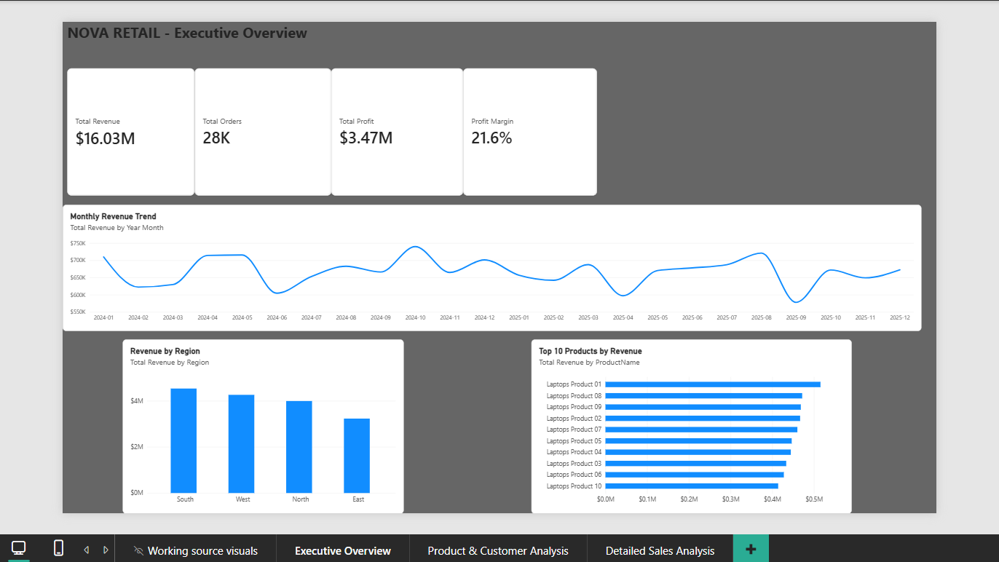
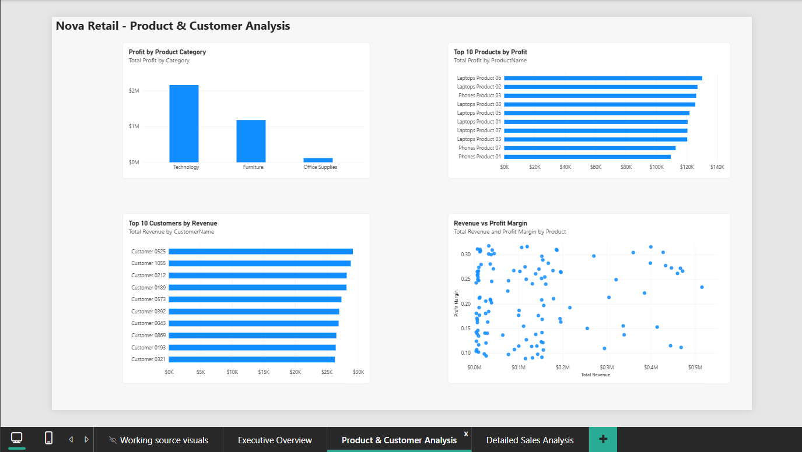
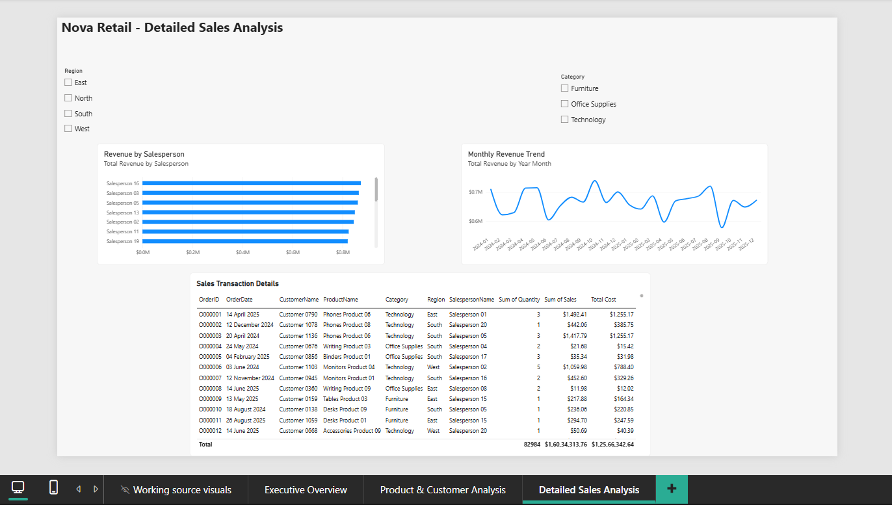

# Nova Retail — Sales Performance & Profitability Dashboard

## Project Overview

Nova Retail is a fictional retail business created for portfolio and analytical practice.

This project transforms raw transactional sales data into an interactive three-page Power BI dashboard for analysing sales performance, profitability, customers, products, regions, and salespeople.

**Tools:** Power BI | Power Query | DAX | Data Modelling

---

## Business Objectives

The dashboard was designed to answer the following business questions:

1. How much revenue and profit is Nova Retail generating?
2. How is revenue changing over time?
3. Which regions contribute the most revenue?
4. Which product categories generate the highest profit?
5. Which individual products generate the most revenue?
6. Which products generate the highest profit?
7. Which customers contribute the most revenue?
8. Are there high-revenue products with relatively low profit margins?
9. Which salespeople generate the highest revenue?
10. How can management use these insights to improve sales and profitability?

---

## Dataset

The project uses five related tables:

| Table | Purpose |
|---|---|
| Sales_Raw | Transaction-level sales, quantity, revenue, cost, discount, and IDs |
| Customers | Customer details and regional information |
| Products | Product names and categories |
| Salespersons | Salesperson information |
| Calendar | Date dimension covering 2024–2025 |

The `Sales_Raw` table acts as the central fact table, while `Customers`, `Products`, `Salespersons`, and `Calendar` function as dimension tables.

**Note:** The dataset is synthetic and was created specifically for portfolio and learning purposes.

---

## Data Cleaning & Transformation

Data preparation was performed using Power Query.

Key activities included:

- Removing duplicate transaction rows.
- Correcting data types, including `OrderDate`.
- Reviewing missing values in key fields.
- Standardising inconsistent text values using trimming.
- Reviewing negative quantities and zero-price records as data-quality issues.
- Preparing the tables for reliable relationships and analysis.

---

## Data Model

The report uses a **star-schema** structure.

### Fact Table

**Sales_Raw**

Contains transactional information including:

- OrderID
- OrderDate
- CustomerID
- ProductID
- SalespersonID
- Quantity
- UnitPrice
- Discount
- Sales
- Cost

### Dimension Tables

- **Customers**
- **Products**
- **Salespersons**
- **Calendar**

The dimension tables are connected to the `Sales_Raw` fact table through one-to-many relationships.

---

## DAX Measures

The main measures created for the analysis were:

- `Total Revenue = SUM(Sales_Raw[Sales])`
- `Total Cost = SUM(Sales_Raw[Cost])`
- `Total Orders = DISTINCTCOUNT(Sales_Raw[OrderID])`
- `Total Profit = [Total Revenue] - [Total Cost]`
- `Profit Margin = DIVIDE([Total Profit], [Total Revenue], 0)`

---

## Dashboard

### Executive Overview

### Product & Customer Analysis

### Detailed Sales Analysis

---

## Key Business Insights

### Regional Performance

The **South region** was the strongest revenue contributor at approximately **$4.53M**, while the **East region** generated approximately **$3.23M**.

This indicates an opportunity to investigate the factors driving stronger performance in the South and identify whether similar strategies could improve performance in the East.

### Revenue Trend

Monthly revenue fluctuated throughout 2024 and 2025 without a clear sustained upward trend.

This suggests that sales performance should be monitored over time rather than assuming continuous growth.

### Product Performance

Laptop products dominated the highest-revenue positions.

The top three revenue-generating products were:

- Laptops Product 01 — approximately $516K
- Laptops Product 08 — approximately $472K
- Laptops Product 09 — approximately $469K

### Revenue vs Profitability

The products generating the highest revenue were not the same products generating the highest profit.

This highlights why product performance should be evaluated using both revenue and profitability rather than sales alone.

### Margin Risk

Laptops Product 09 generated approximately **$468.5K in revenue**, but its profit margin was only **11%**.

This makes it a potential candidate for further investigation into pricing, discounting, and cost structure.

---

## Recommendations

Based on the analysis, management could:

- Investigate the factors contributing to stronger South-region performance.
- Explore opportunities to improve performance in the East.
- Monitor high-revenue products with relatively low profit margins.
- Review pricing, discounting, and cost structures for low-margin products.
- Evaluate products using both revenue and profit metrics.
- Monitor monthly performance to identify recurring trends and fluctuations.

---

## Tools & Skills Demonstrated

### Power BI

- Dashboard development
- Interactive visualisations
- Slicers and visual interactions
- Report design

### Power Query

- Data cleaning
- Duplicate removal
- Data transformation
- Text standardisation
- Data type management

### DAX

- Measures
- Aggregations
- `SUM`
- `DISTINCTCOUNT`
- `CALCULATE`
- `DIVIDE`
- Profitability calculations

### Data Modelling

- Star schema
- Fact and dimension tables
- One-to-many relationships
- Calendar table

### Business Analysis

- Revenue analysis
- Profitability analysis
- Regional analysis
- Product analysis
- Customer analysis
- Salesperson performance

---

## Disclaimer

This project uses **synthetic data** created for portfolio and learning purposes. Nova Retail is a fictional business.
